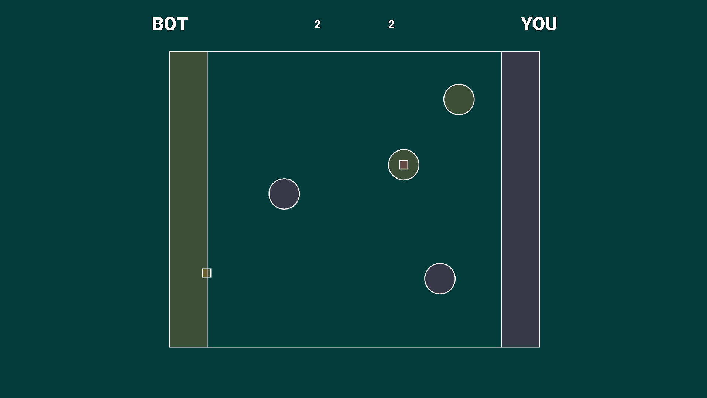
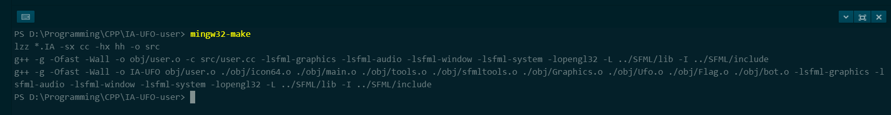

# AI-UFOs installer

## Introduction
This Git repository is the installer of the game **AI-UFOs**.
AI-UFOs folder is the game folder.
SFML folder is the graphic library folder.
Platform is the folder gathering tools you need to run the game depending on your platform.
You have to download the whole repository and follow the setup to play game.
Once setup correctly, you have to follow the instruction to learn how to play.

## Setup
From the folder Platform, open the folder corresponding to your platform.

### Windows users
There is three folder:
- Lzz is a tool to write the code easier in C++
- SFML is the graphic library corresponding to your platform
- mingw64 is a C++ compiler

Please follow the instruction bellow to setup each of these.

#### Lzz - Lazy C++
Move the executable file [lzz.exe](Platform/Windows/Lzz/lzz.exe) to your system folders of your computer and [add its path to your system environement variables](https://www.computerhope.com/issues/ch000549.htm). Check in the Powershell if the command:
> lzz -ver
is available. You might have to relaunch your Powershell.
For further informations, please visit the [website](http://www.lazycplusplus.com).

#### SFML - The graphic library
You have nothing to do as Windows user with SFML because the game is already compiled for it. You can go to the next step.
Version:
> GCC 7.3.0 MinGW (SEH) - 64-bit
for further informations, please visit the [website](https://www.sfml-dev.org/).

#### MingGW - The C++ compiler
As SFML has been written and compiled with the MingGW 7.3.0 64-bit version, you need to get this exact compiler to play the game. Please move the whole folder to your system folders like Lzz and make sure to add the bin/ folder path to your environement system. Thus, you should have access to the [g++.exe](Platform/Windows/mingw64/bin/g++.exe) and [mingw32-make.exe](/Platform/Windows/mingw64/bin/mingw32-make.exe) executable files in the bin/ folder. Check the version 
for further informations, please visit the [website](http://www.mingw.org/).

### MacOS users
mdr contactez théo svp theo.mercurio@ipsa.fr

## How to play
The game is a 2 VS 2 UFOs fight with artificial intelligence.
You have to improve the code to control your two UFOs to improve their intelligence.
To win the game, you have to bring more flags to your base than your opponent.
You loose a flag if you get collided with less velocity.

