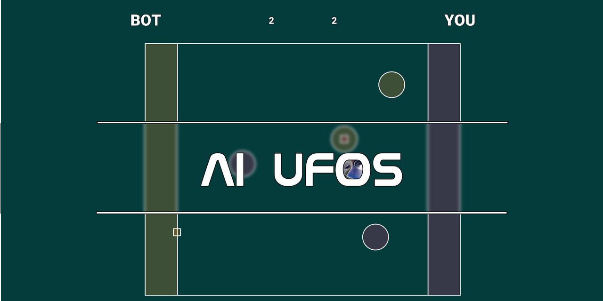
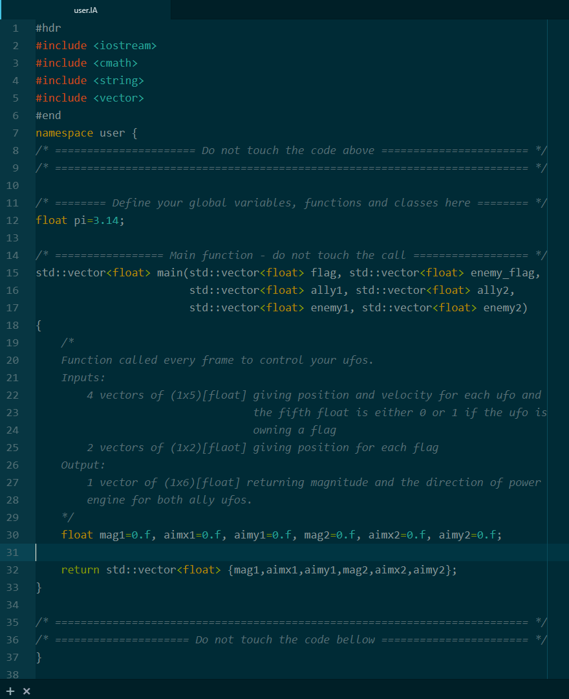

# AI-UFOs installer

## Introduction
The official **AI-UFOs** multi-platform installer. Game based on the CodInGame Thales Hackathon. Follow the instructions in the section Setup concerning your platform. Once installed correctly, read the How to play manual before playing.

## Setup
Open the folder corresponding to your platform.

### Windows users
There is four folders:
- [AI-UFOs/](Windows/AI-UFOs) is the game folder
- [Lzz/](Windows/Lzz) is a tool to write C++ header automatically
- [mingw64/](Windows/mingw64) is a C++ compiler
- [SFML/](Windows/SFML) is the graphic library

You can move your game folder but **you need to keep the two folders [AI-UFOs/](Windows/AI-UFOs) and [SFML/](Windows/SFML) in the same folder** as they are presented [here](Windows/). You can rename the toplevel [Windows/](Windows/) folder, the game and SFML juste need to communicate each other.

#### Lzz - Lazy C++
Move the executable file [lzz.exe](Windows/Lzz/lzz.exe) to your computer system folders and [add its path to your environement system variables](https://www.computerhope.com/issues/ch000549.htm).

Check in the Powershell if the command:
> lzz -ver

is available. You might need to relaunch your Powershell.

For further informations, please visit the [website](http://www.lazycplusplus.com).

#### MingGW - The C++ compiler
As SFML has been written and compiled with the MingGW *7.3.0 64-bit* version, you need to get this exact compiler to play the game.

Please move the [mingw64/](Windows/mingw64) folder to your computer system folders, just like you did for [Lzz/](Windows/Lzz) and make sure to add the [mingw64/bin/](Windows/mingw64/bin) folder path to your [environement system variables](https://www.computerhope.com/issues/ch000549.htm).

Thus, you should have access to the [g++.exe](Windows/mingw64/bin/g++.exe) compiler and the [mingw32-make.exe](/Windows/mingw64/bin/mingw32-make.exe) makefile.

Check the version of both commands in your Powershell with:
> g++ --version

and
> mingw32-make --version

For further informations, please visit the [website](http://www.mingw.org/).

#### SFML - The graphic library
You have nothing in particular to do except to make sure to keep the [folder structure](Windows/) with [AI-UFOs/](Windows/AI-UFOs).

The game has been compiled with the SFML version *GCC 7.3.0 MinGW (SEH) - 64-bit*.

For further informations, please visit the [website](https://www.sfml-dev.org/).

### MacOS users
Please contact theo.mercurio@ipsa.fr

## How to play manual
The game is a 2 VS 2 UFOs fight with artificial intelligence.
You have to improve the given code to control your two UFOs to improve their intelligence.
To win the game, you have to bring more flags to your base than your opponent.
You loose a flag if you get collided with less velocity.

To play:
- edit the code *user.AI*
- compile it to implement your updates to the game with:
    > mingw32-make

- if there is no mistake in your code, you can run AI-UFOs to observe your results!

Dimension:
- board 10000x8000
- base width 1000

Physic properties:
- ground has tiny friction
- UFO collisions are solid
- wall collisions are elastic

